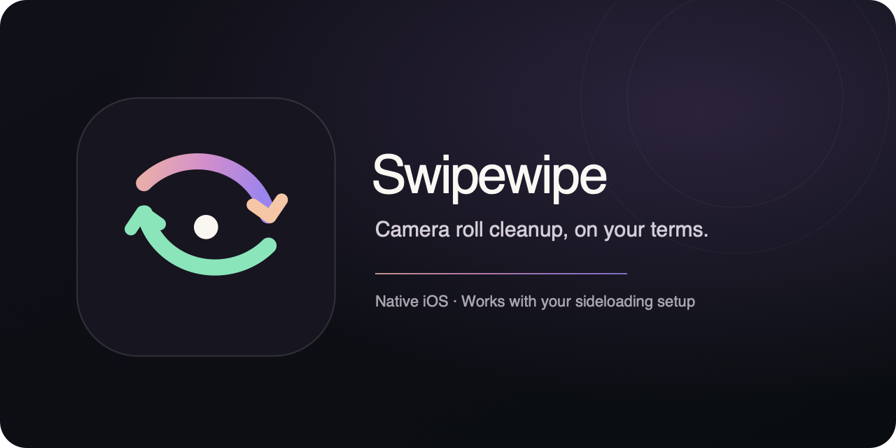

<div align="center">
  

  <p><strong>A native iOS photo cleaner for your sideloading setup.</strong><br />
  Review your camera roll at your pace. Keep what matters. Confirm before anything is deleted.</p>

  <p>
    <a href="https://github.com/hesm4tt/swipewipe-cleanup/releases/latest"></a>
    <a href="https://github.com/hesm4tt/swipewipe-cleanup/releases"></a>
    
    
  </p>

  <p><a href="https://hesm4tt.github.io/swipewipe-cleanup/">Install options</a> · <a href="https://github.com/hesm4tt/swipewipe-cleanup/releases/latest/download/SwipewipeCleanup.ipa">Latest IPA</a> · <a href="CHANGELOG.md">Changelog</a> · <a href="CONTRIBUTING.md">Contributing</a></p>
</div>

## What it does

Swipewipe Cleanup is an unofficial, native SwiftUI app for sorting photos on iPhone and iPad. It works with standard IPA sideloading workflows; LiveContainer is one supported way to run it.

- Review photos month by month, or let **Random 40** choose a shuffled set of up to 40.
- Swipe or tap to keep a photo or mark it for deletion.
- Undo the last decision, bookmark a photo, and return to any month at any time.
- Review the deletion queue and remove anything from it before confirming.
- See session and all-time storage totals, saved bookmarks, and “On This Day.”
- Export an in-app diagnostic log to help investigate decision and deletion issues.

**Nothing is deleted while you swipe.** Only photos still in the deletion queue after your review are passed to Photos when you confirm. A keep decision is stored separately from the deletion queue.

## Install

Choose the installer you already use. The install page has direct actions for compatible apps and download/import steps for desktop signers:

**[Open Swipewipe install options →](https://hesm4tt.github.io/swipewipe-cleanup/)**

| Installer | How to install |
| --- | --- |
| [LiveContainer](https://github.com/khanhduytran0/LiveContainer) | Open the install page on your iPhone and choose **LiveContainer**. |
| [SideStore](https://sidestore.io/) | Open the install page on your iPhone and choose **SideStore**. See the [official URL schema](https://docs.sidestore.io/docs/advanced/url-schema). |
| [AltStore Classic](https://altstore.io/) | Add the Swipewipe source from the install page, then install the app from AltStore. See [AltStore source docs](https://faq.altstore.io/altstore-classic/your-altstore). |
| [SideInstaller](https://github.com/FrizzleM/SideInstaller) | Download the IPA below and import it in SideInstaller. |
| [Sideloadly](https://sideloadly.io/) | Download the IPA below and select it in Sideloadly on your computer. |
| Other IPA signers | Download the IPA and use your signer's normal import flow. |

[**Download SwipewipeCleanup.ipa**](https://github.com/hesm4tt/swipewipe-cleanup/releases/latest/download/SwipewipeCleanup.ipa)

This is an unsigned IPA. The sideloading tool you choose handles its own signing or execution requirements. **AltStore PAL is not supported by this build**; [PAL distribution requires Apple-notarized apps](https://faq.altstore.io/developers/distribute-with-altstore-pal).

### AltStore source

For AltStore Classic, add this source in the app:

```text
https://hesm4tt.github.io/swipewipe-cleanup/AltStoreSource.json
```

## Privacy

Swipewipe uses Apple’s Photos framework on device. It does not upload your library. Diagnostic logs record decision events with salted, hashed asset references; they do not contain image contents or raw Photos identifiers. Review any exported log before sharing it.

## Build from source

Requirements: macOS with full Xcode and an iOS SDK. The project targets iOS 16 and uses system frameworks.

```sh
git clone https://github.com/hesm4tt/swipewipe-cleanup.git
cd swipewipe-cleanup
./build-ipa.sh
```

The script creates an unsigned `SwipewipeCleanup.ipa` in the project directory. See [Contributing](CONTRIBUTING.md) for bug report and change guidelines.

## Project status

This is an independent project and is not affiliated with Swipewipe, LiveContainer, SideStore, AltStore, SideInstaller, or Sideloadly. Swipewipe Cleanup is provided as-is. Please keep a backup of photos you care about and review the deletion queue before confirming.
